# Weekly assesment. Week 2
## Task 1. Create Jenkins VM with internet access(1 point)
### Installing openjdk-8-jdk and git: 
 ````sh
 $ sudo apt-get install openjdk-8-jre git
 ````
### Install Jenkins with enabling autostart on startup:
````sh
wget -q -O - https://pkg.jenkins.io/debian-stable/jenkins.io.key | sudo apt-key add - 
sudo sh -c 'echo deb https://pkg.jenkins.io/debian-stable binary/ > /etc/apt/sources.list.d/jenkins.list'
sudo apt-get update
sudo apt-get install -y jenkins
sudo systemctl enable jenkins
sudo systemctl jenkins status
````
### Setup custom port 8081 for Jenkins:
To setup custom port we need to correct the patametr HTTP_PORT from 8080 to 8081 in file /etc/default/jenkins:
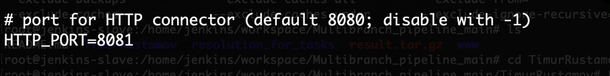
### Plugins – select plugins, add GitHub and Role-based authorization strategy:
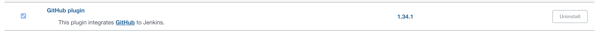
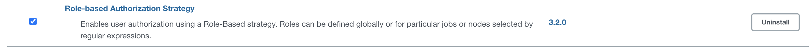
### Add new user – jenkins-NAME (your fullname, jenkins-linustorvalds):
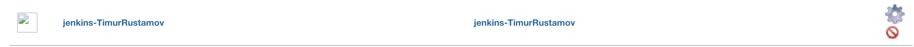
## Task 2. Create agent VM(1 point)
### Installing openjdk-8-jdk and git: 
 ````sh
 $ sudo apt-get install openjdk-8-jre git
````
### Prepare SSH keys: 
On master node we generete ssh keys(if we have no any keys yet). Than we add key /home/user/.ssh/id_rsa.pub from master node to /home/user/.ssh/authorized_keys
````sh
ssh-keygen #on master node to generate keys
cat .ssh/id_rsa.pub #on master node to get value of key
nano .ssh/authorized_keys #on slave node and paste the value of key from master here, than save the file
````
Than we can check ssh connection from master to slave via terminal, if it's successful we can add agent node to master in Jenkins.
### Connect agent node to master: 
To connect agent node we go to Manage Jenkins -> Manage nodes and clouds -> New node. Give the name to agent(this name we will use as label of agent)
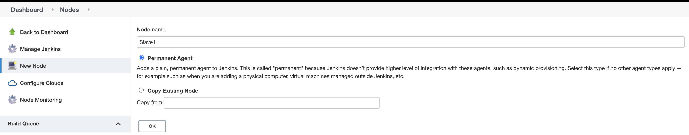
Than configure connection:
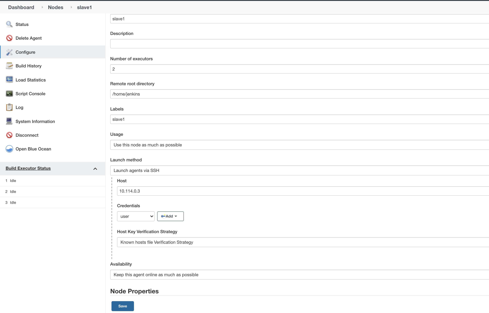
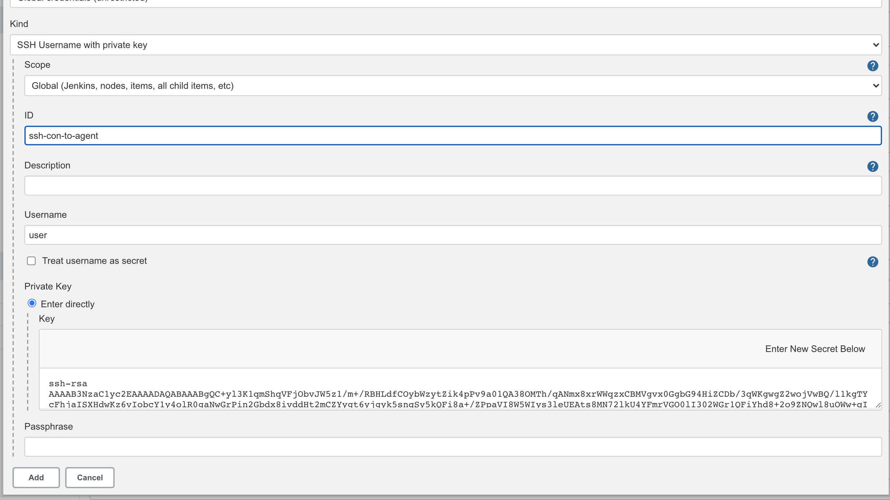
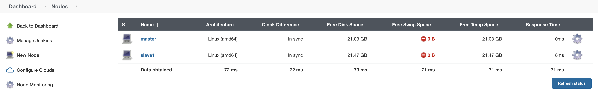
## Task 3. Configure tools – NodeJS(1 point):
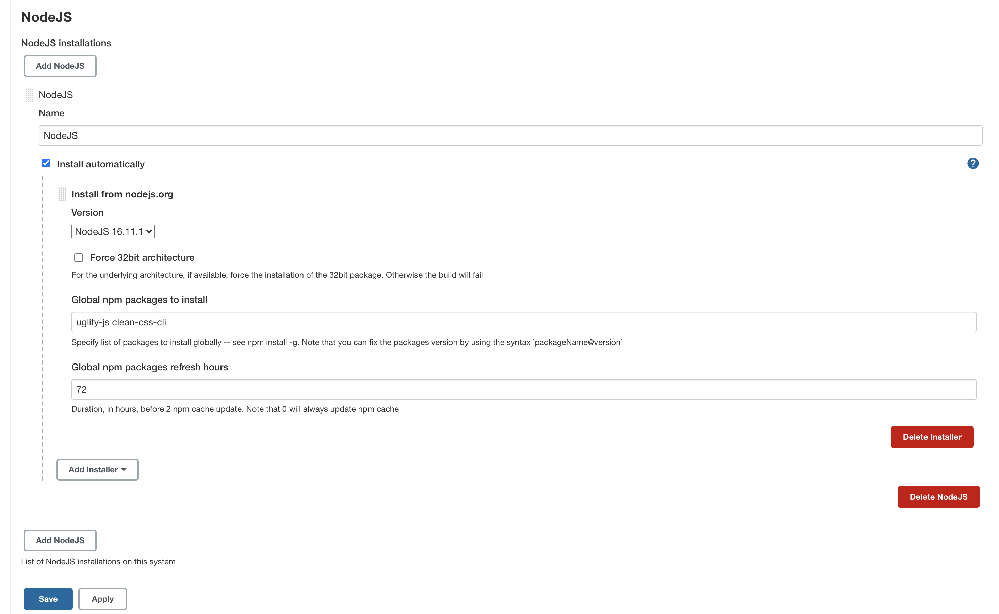
## Task 4. Create “Multibranch Pipeline” pipeline job (work inside Lab folder)(3 points):
### Creating multibranch pipeline:
New item -> Multibranch Pipeline. Here we name our job and go to configuring it. </p>
We need to configure "Branch sources" and "Build configuration". Other configuration is optional. 
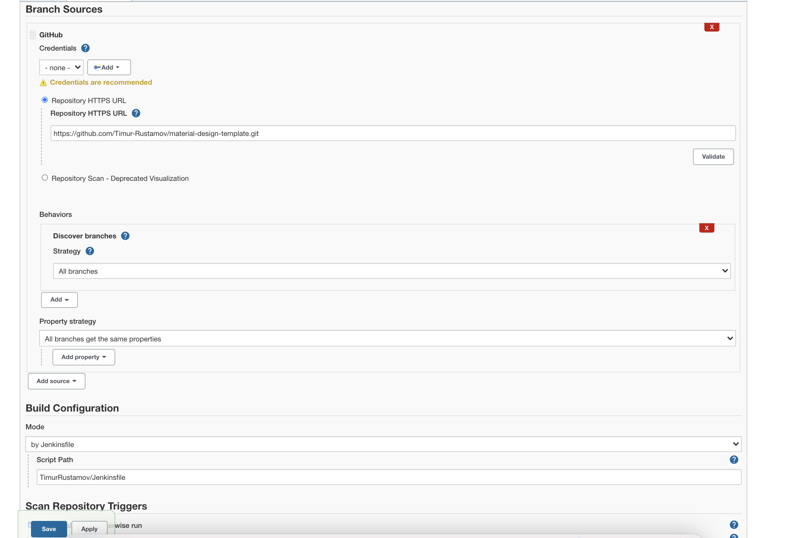
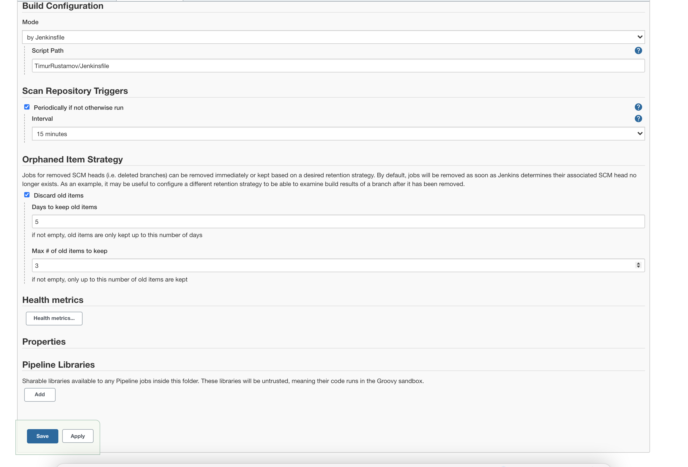
### Write Jenkinsfile which describes declarative pipeline:
#### a) Define NPM tools in pipeline section
#### b) Run in parallel stages for compressing JS, CSS files by using next utils:
- Uglify-js</p>
- cleans-css </p>
www/css -> www/min </p>
www/js -> www/min </p>
#### c) Create tar archive (ignore .git, css and js folders)
#### d) Archive result 
Declarative pipeline: https://github.com/Timur-Rustamov/material-design-template/blob/main/TimurRustamov/Jenkinsfile 
Scan log:
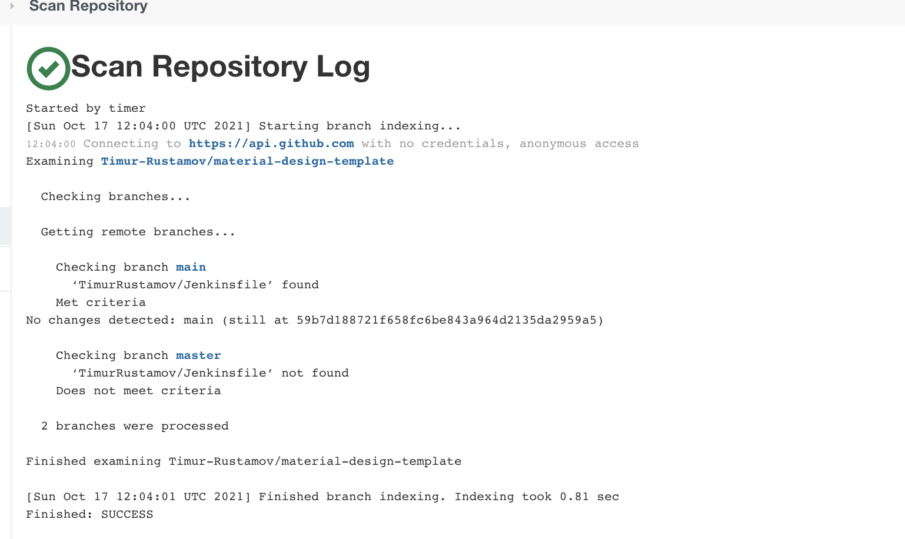
Build log - link to build log
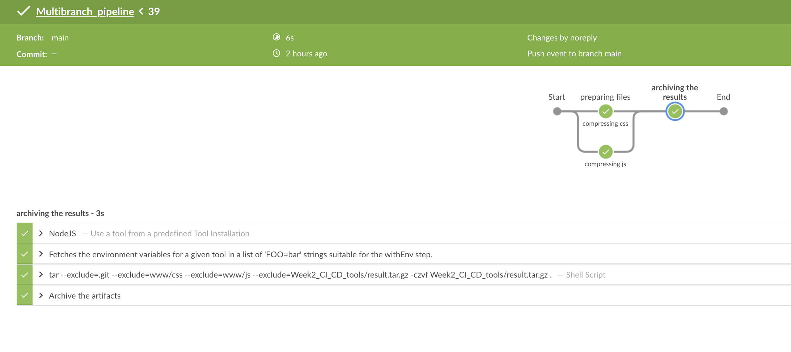
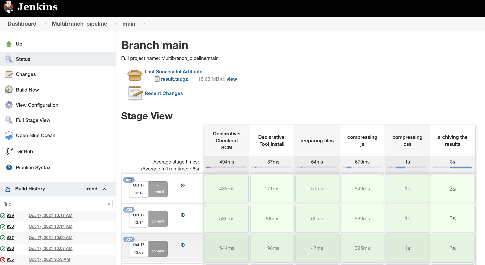
## Task 5. Setup the GitHub webhook to trigger the jobs(2 points)
### Poll SCM in job settings:
To have controll of changes in repo i setup "Scan repository triggers" for scanning every 2 hours from the last scan.
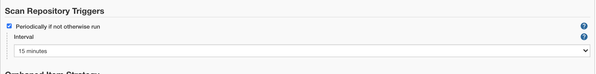
### GitHub hook:
To configure GitHub hook we go to repo settings -> Webhooks-> Add webhook: 
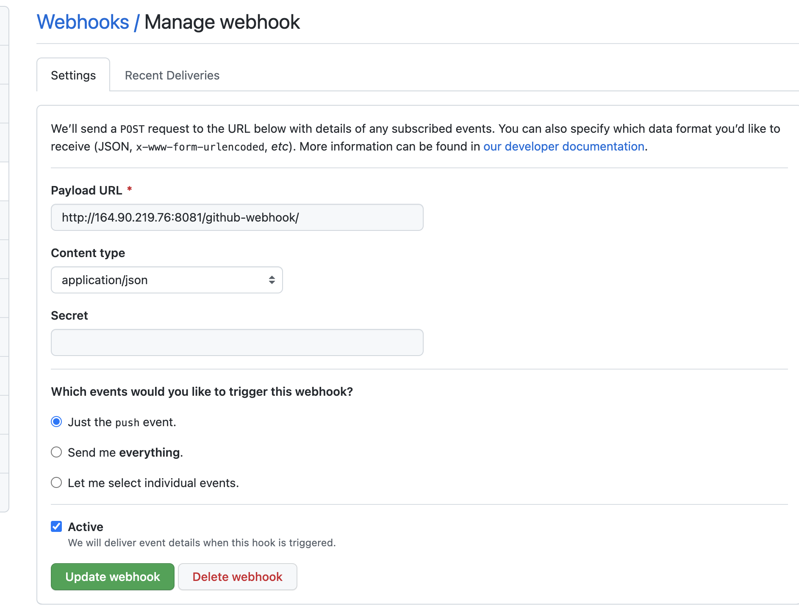
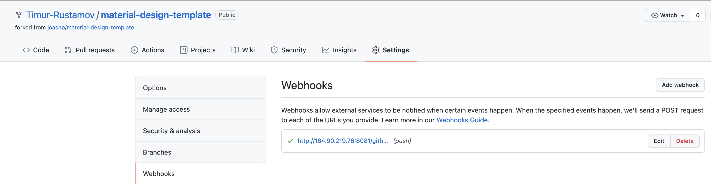


